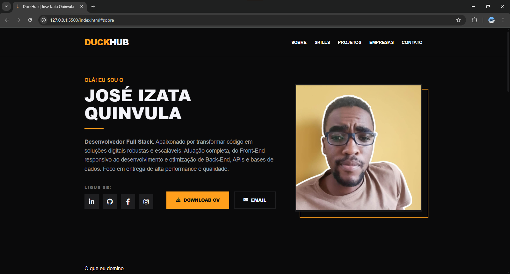
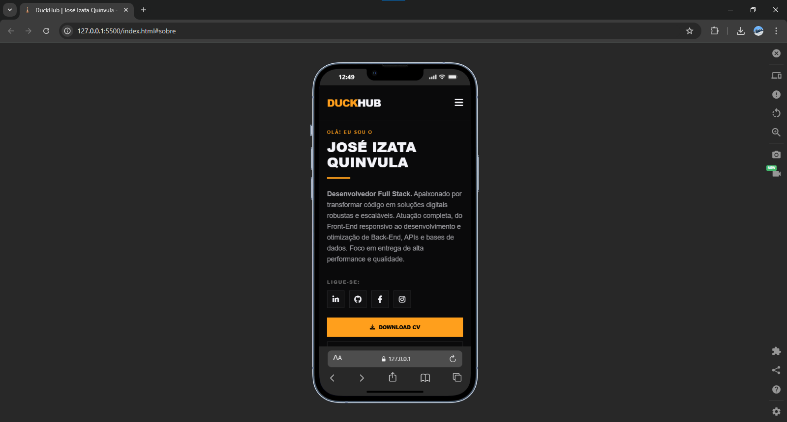

# Duck Stack - Portfólio Técnico

[](https://joseizataquinvula.pages.dev/)
[](https://github.com/JoseIzataQuinvula/duck-stack)
[](https://developer.mozilla.org/pt-BR/docs/Web/HTML)
[](https://developer.mozilla.org/pt-BR/docs/Web/CSS)
[](https://developer.mozilla.org/pt-BR/docs/Web/JavaScript)

Este repositório contém o código-fonte do Duck Stack, um portfólio desenvolvido para centralizar projetos de software, competências técnicas e documentação profissional. O projeto foi estruturado com foco em modularidade, semântica e performance.

## Visão Geral

O Duck Stack funciona como uma plataforma de apresentação profissional. A arquitetura foi planejada para permitir a inclusão de novos projetos de forma escalável, utilizando uma separação clara entre as camadas de dados, estilo e comportamento.

---

## Arquitetura de Pastas

A organização do diretório segue o padrão de separação de responsabilidades (internacionalizado para Inglês):

* **Raiz:** Arquivos de configuração global, SEO e entrada principal.
* **views:** Páginas de navegação interna e tratamento de erros.
* **assets/css:** Folhas de estilo segregadas por componentes.
* **assets/js:** Lógica de programação em JavaScript puro.
* **assets/images:** Armazenamento de ativos estáticos e recursos visuais (incluindo `covers`, `previews` e `svg`).
* **assets/docs:** Arquivos de documentação técnica e currículos.

---

## Especificações Técnicas

O desenvolvimento foi realizado sem a dependência de frameworks externos, priorizando o desempenho nativo:

* **Estrutura:** HTML5 Semântico.
* **Estilização:** CSS3 com design responsivo.
* **Comportamento:** JavaScript Assíncrono.
* **Indexação:** Configurações de SEO para rastreamento.

---

## Demonstração da Interface

### Interface Desktop



### Interface Mobile



---

## Procedimentos de Instalação

Para replicar o ambiente de desenvolvimento localmente, siga os passos abaixo:

1. Clone o repositório:

```bash
git clone https://github.com/JoseIzataQuinvula/duck-stack.git
cd duck-stack
```

---

## Autoria

Desenvolvido com rigor técnico e design por **José Izata Quinvula**.

---

© 2025 - 2026 **José Izata Quinvula** - Todos os direitos reservados.
